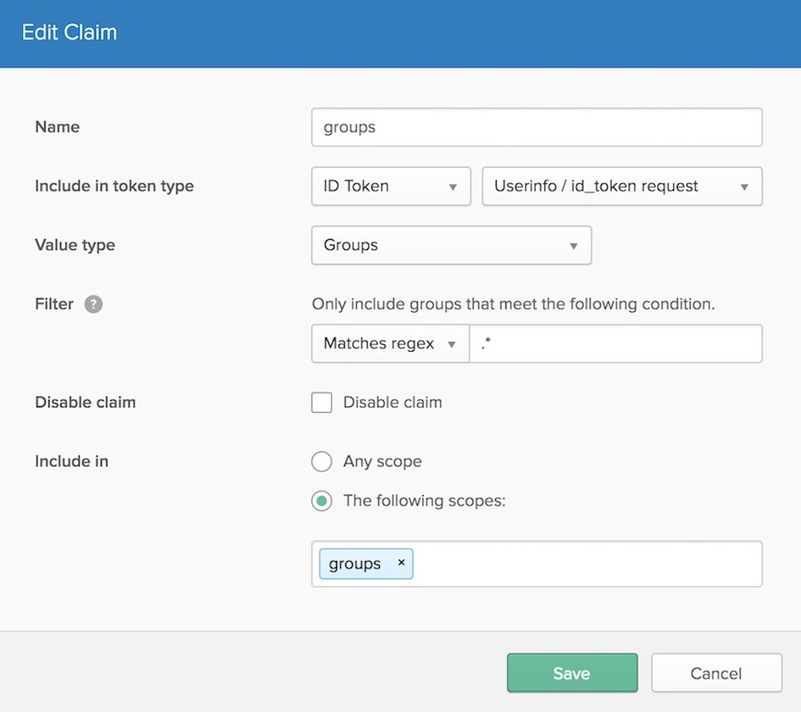

# Okta Provider Setup & Configuration

In order for **sso** to use Okta as it's OAuth provider there are some manual steps that must
be followed to create and configure the necessary credentials.

## 1. Create an Authorization Server
Use a web browser to access your Okta account administrator console.

Select the 'Security' dropdown and then 'API'. If you don't then see 'Authorization Servers' then
you will need to contact Okta Support to have this feature enabled.
(If you are logged in to an Okta Developer console, then this will be under the 'API' dropdown and then 'Authorization Servers')

For the purpose of this example we will use the default server that is provided, however you can create a new one if preferred.

## 2. Configure your Authorization Server
- Select your Authorization server, and then 'Scopes' and 'Edit'. The only additional scope you will need to add is a scope for groups.

	Click 'Add Scope' and fill in the fields with the below options:

	It is important the **Name** is simply `groups`. The other fields can be customised however we recommend the above.

- Select 'Claims' and then 'Edit'. You now need to add a claim for `groups`.

	Click 'Add Claim' and fill in the fields with the below options:

	The regex for `Filter` can be changed to fit your organisational requirements.
    This determines whether all groups (that are assigned to the application you will create below)
    a user is a member of will be returned, or if only a subset of groups matching the given regex will be returned.
    The above setting will return all groups the user is a member of.

## 3. Create a new Application
- Select the 'Applications' dropdown and then 'Applications'. Click 'Add Application' and 'Create New App'

	 For 'Platform', choose `Web`, and for 'Sign on method' choose `OpenID Connect`. You will be asked to fill in some fields:
	-	**Application Name**: Any appropriate name.
	- **Application Logo**: Optional - an image for your app.
	- **Login redirect URIs**: Add the URI of your `sso-auth` deployment, with the path suffix `/oauth2/callback`.
    For example, if `sso-auth` will be accessible at the domain `sso-auth.example.com`, then add the URI
    `https://sso-auth.example.com/oauth2/callback`. Multiple URIs can be added if required.
	- **Logout redirect URIs**: This can be left blank.

## 4. Finish configuring your Application

- Once your application is created, you will be redirected to the Application's settings page.
We want to allow `sso-auth` to request Refresh Tokens, so select 'Edit' under 'General Settings'
and make sure `Refresh Token` is checked under 'Client acting on behalf of a user'

- At the bottom of this same page you will see a section called 'Client Credentials' containing a `Client ID` and a `Client secret`.
Copy both of these values to a safe and secure location - these are required to configure your `sso` deployment.

**⚡️Note:**  If you're following the  [Quickstart guide](https://github.com/buzzfeed/sso/blob/master/docs/quickstart.md),  **stop here!**
You'll add these credentials to  `quickstart/env`  as instructed in  [the guide](https://github.com/buzzfeed/sso/blob/master/docs/quickstart.md).

- Now we need to assign relevant users and groups to the Application. Make sure that any users that will be authenticating through `sso` are assigned here,
either through 'People' assignment, or 'Groups' assignment.

	 *Only groups that are assigned to this app will be returned along with the `groups` scope/claim*
